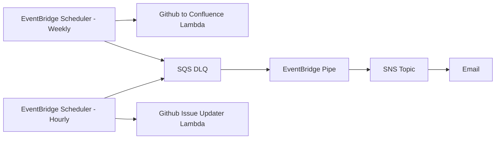

### Goal

To generate a confluence page with a summary of the current and recent work scraped from a github projects board.

The issues on the board are set up as follows:

- `Status` field with values `To Do`, `In progress`, `Done`, `Blocked`
- `Project` field, with the name of the project (optionally with a Jira ticket number and Atlas project name), e.g. `Some Project - JIRA-12345, ATLASPRJ-123`

Once reported on, any issues in `Done` will be automatically be labelled with 'Reported', and any existing tickets originally labelled as reported will be archived.

### Infra

Deployed with a CDK project to a dedicated AWS account:

- Lambda: queries github, generates a page body and updates an existing confluence page
- EventBridge Rule: schedules the execution of the lambda once per week

Deploying: in the simplest case, run `npm run synth` to generate output to the cdk.out folder, and `npm run deploy` to deploy, or `npm run cdk -- diff` to see what will change.

### Page Layout

- Goals
  - A summary of each unique project, split into "now" (derived from tickets in progress) and "next up" (from those in To Do)
- Weekly Engineering
  - Two itemised lists: Recently Done (broken down by project, drawn from the "Done" status), and "Now" (from the In Progress status)

### Infra



### Maintenance

#### Dependencies

- ```shell
  nvm use || nvm install
  npm ci
  npx npm-upgrade
  rm package-lock.json
  rm -rf node_modules
  npm install
  npm ci
  npm audit # examine output to see if any packages are vulnerable
  ```
- Check to see if any later version is available in the `runtime: lambda.Runtime.NODEJS_...` line in the infra source files. If so, update and `npm run deploy`.
- Run the Node Version Reporter lambda to see the exact node version that lambda would run:

  ```shell
  npm run jsversion
  # {...., "body":"\"Version: x.x.x\""} ...
  ```

  - If this is different from the value in `.mvnrc` then update `.nvmrc` with the new version and run `nvm install && npm ci`.
  - If this includes a major version upgrade, also update the `tsconfig` dependency and the `tsconfig.json` file, and also run `npm i` to rebuild the package lock file.

### CDK

- Sometimes the CDK itself will need updating - this happens once in a blue moon, but eventually stacks will stop deploying unless the environment is periodically re-bootstrapped:

  ```shell
  npm run cdk -- bootstrap

   ⏳  Bootstrapping environment aws://381491894561/eu-west-1...
  Trusted accounts for deployment: (none)
  Trusted accounts for lookup: (none)
  Using default execution policy of 'arn:aws:iam::aws:policy/AdministratorAccess'. Pass '--cloudformation-execution-policies' to customize.
  CDKToolkit: creating CloudFormation changeset...
  ✅  Environment aws://381491894561/eu-west-1 bootstrapped.
  ```

#### Testing Changes

- If this is your first time running this project locally:
  - Populate the missing env variables in `environ`.
  - Populate the keychain with the API keys by running `./update-local-secrets.sh`.
    - NOTE: if the token is longer than 128 characters, you may have to edit it manually in the Keychain Access app to have the full string.
- Load the environment for the task to run in with `source environ`
- Run locally to test with `npm run reporter` (this will update confluence (specifically a test page under my personal space, easily changed in package.json), but _won't_ modify the github board).
- Run locally to test with `npm run updater` (this will list what actions would be taken, but _won't_ modify the github board).
